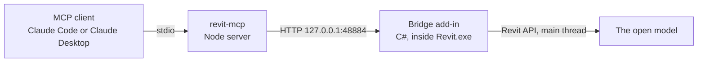

# revit-mcp

[](https://www.autodesk.com/products/revit/overview)
[](#requirements)
[](https://nodejs.org)
[](#development)
[](LICENSE)

**Drive Autodesk Revit from Claude.** `revit-mcp` connects an MCP client to the
Revit model open on your desktop, so you can query it, edit it, and produce a
full drawing set in plain language — levels and elements, sheets and schedules,
views and PDF exports.

Revit has no external API: the Revit API is in-process .NET that exists only
inside `Revit.exe` and may only be called from its main thread. So this project
has two halves — a Node MCP server, and a C# add-in that Revit loads at startup
and that listens on loopback HTTP. The add-in ships precompiled, so installing
it is a file copy and no .NET SDK is needed.



## Features

- **Query the model** — levels, categories, element filters, selection, and
  parameters, with paging and total counts.
- **Edit the model** — create levels, walls, floors, toposolids and pipes,
  place families, planting and openings, set parameters, delete elements.
- **Build drawings** — sheets, views, sections, plans, legends, schedules,
  title blocks, and sheet collections.
- **Control graphics** — view templates, category overrides, crop regions,
  display styles, sun and background settings.
- **Export** — view images and native multi-sheet PDFs.
- **Runs unattended** — modal dialogs and transaction warnings are answered by
  the bridge and recorded for you to read back.
- **Hot reload** — rebuild the C# endpoints and reload them into a running
  Revit with the model still open.
- **One call, one undo step** — every write is a single transaction group.

## Requirements

| | |
| --- | --- |
| **OS** | Windows (Revit has no macOS build) |
| **Revit** | 2025, 2026 or 2027 |
| **Node.js** | 18 or newer |
| **.NET SDK** | Not required — only to build the C# side yourself |

One prebuilt add-in covers all three Revit versions: it is compiled against the
Revit 2025 reference assemblies, which load unchanged in 2026 and 2027. Tested
end to end against Revit 2027.3. **Revit LT is unsupported** (no add-in API) and
**2024 and earlier are refused** (.NET Framework 4.8 cannot load a
`net8.0-windows` assembly).

## Installation

> **Not yet on npm.** Install from GitHub with `npx -y github:rui-branco/revit-mcp`.
> Once published, `npx -y @rui.branco/revit-mcp` will work identically.

### 1. Register the server

<details open>
<summary><b>Claude Code</b></summary>

```bash
claude mcp add revit --scope user -- npx -y github:rui-branco/revit-mcp
claude mcp list
```

`--scope user` enables it in every project; `--scope project` writes it to the
repo's `.mcp.json` instead, to share with a team.

</details>

<details>
<summary><b>Claude Desktop</b></summary>

Open **Settings → Developer → Edit Config** (that is
`%APPDATA%\Claude\claude_desktop_config.json`) and add the `revit` entry,
keeping any servers already there:

```json
{
  "mcpServers": {
    "revit": {
      "command": "npx",
      "args": ["-y", "github:rui-branco/revit-mcp"]
    }
  }
}
```

Then **quit Claude Desktop from the system tray** — closing the window is not
enough — and reopen it. The Revit tools appear under the tools icon.

If the server shows as failed, Claude Desktop could not find `npx` on its
`PATH`. Use absolute paths instead (`where.exe npx.cmd` prints yours), or point
`command` at your `node.exe` with `args` of
`["C:\\path\\to\\revit-mcp\\index.js"]`.

</details>

<details>
<summary><b>Other MCP clients</b></summary>

Any stdio MCP client works. Use `npx -y github:rui-branco/revit-mcp` as the
server command; it takes no arguments and needs no environment beyond the
optional [configuration](#configuration).

</details>

### 2. Install the Revit add-in

Ask Claude to **install the Revit bridge**. That runs `revit_install_bridge`,
which copies the add-in and its `.addin` manifest into
`%APPDATA%\Autodesk\Revit\Addins\<version>\` for every Revit it finds. Revit
need not be running, and re-running is safe.

### 3. Restart Revit and approve the add-in

Revit scans the Addins folder only at startup. On first load it shows a
**"Security - Unsigned Add-In"** dialog for `RevitMcpBridge` — this is expected,
the add-in is not code-signed. Choose **Always Load**; *Do Not Load* is
remembered and the bridge will never start.

### 4. Verify

Open a model and ask Claude to run `revit_status`. It reports the bridge
version, Revit version and active document, confirming the chain end to end.

<details>
<summary><b>Installing manually, or uninstalling</b></summary>

From the package's `revit-bridge` directory:

```powershell
.\install.ps1
```

| Flag | Effect |
| --- | --- |
| `-RevitVersion 2026` | Only that version, even outside the default Program Files location. |
| `-Build` | Compile a fresh add-in with `dotnet build -c Release`. Needs the .NET SDK. |
| `-SkipBuild` | Never build. Already the default when the bundled add-in is present. |
| `-Uninstall` | Remove the manifest and the install folder. |
| `-Json` | Emit one JSON result object as the only stdout output — the mode the MCP tools use. |

Exit codes: `0` success, `1` unhandled failure, `2` no Revit found, `3` no
supported Revit version, `4` build failed or .NET SDK missing, `5` no add-in to
install. Runs under Windows PowerShell 5.1 and PowerShell 7.

To uninstall: ask Claude to uninstall the Revit bridge
(`revit_uninstall_bridge`) and restart Revit, then `claude mcp remove revit` or
delete the entry from `claude_desktop_config.json`.

</details>

## Usage

With a model open in Revit, ask in plain language:

```
What levels are in this model?
How many walls are there, and what types?
Add a level at 3 m and a second at 6 m.
Set Comments to "reviewed" on everything I have selected.
Create sheets L.02.001 through L.02.010 with the A0 title block.
Make a plan of each level at 1:100 and place it on its sheet.
Schedule the planting by type, with quantities, and put it on L.09.017.
Export every sheet to one PDF.
```

Two habits worth keeping:

- Ask for **one phase per call** — all ten sheets in one request, not ten
  requests. Each call is one undo step.
- After a batch of writes, ask for `revit_diagnostics`. Warnings the bridge
  resolved silently are recorded there and nowhere else.

## Tools

88 tools, grouped below; every write is one undo step.

### Conventions

- Units are Revit internal units (decimal feet) in both directions, unconverted: a level at 3 m is `9.8425`.
- `revit_query_elements` caps at 500 rows (default 100) and always returns the total match count.
- `revit_get_elements` returns only the parameters named in `params`; without it, identity fields only.
- One tool call is one undo step: each write is a transaction group, assimilated on success, rolled back on failure.
- `revit_create_sheets` skips sheet numbers that already exist rather than failing, so re-running is safe.
- A view lives on exactly one sheet; a placed view returns `VIEW_ALREADY_PLACED`, so use `revit_duplicate_view`.

<details>
<summary><b>Status &amp; diagnostics</b> (4 tools)</summary>

| Tool | Description |
| --- | --- |
| `revit_status` | Returns bridge status, Revit version, units, user, and the active document (`null` when none). |
| `revit_diagnostics` | Lists dialogs the bridge answered and warnings it resolved; check after a batch of writes. |
| `revit_set_auto_dismiss` | Toggles dialog auto-dismiss at runtime, optionally clearing the diagnostics buffer. |
| `revit_get_warnings` | Reads the warnings the model carries right now — Revit's own Review Warnings list. |

</details>

<details>
<summary><b>Query &amp; read</b> (6 tools)</summary>

| Tool | Description |
| --- | --- |
| `revit_list_levels` | Lists every level in the model as `{ id, name, elevation }`. |
| `revit_list_categories` | Lists every category present in the model with its element count, busiest first. |
| `revit_query_elements` | Filters elements by category, level and type name with `limit`/`offset`; returns the total. |
| `revit_get_elements` | Returns rows for specific element ids, carrying only the parameters named in `params`. |
| `revit_get_selection` | Returns what the user currently has selected in the Revit UI. |
| `revit_inspect_elements` | Measures elements: geometry, bounds and placement that `revit_get_elements` leaves out. |

</details>

<details>
<summary><b>Document &amp; project</b> (5 tools)</summary>

| Tool | Description |
| --- | --- |
| `revit_new_project` | Creates and opens a project from an `.rte` template; `overwrite: true` rebuilds it in place. |
| `revit_open_project` | Opens an existing `.rvt` as the active document; works with no document open. |
| `revit_save` | Saves the active document in place; a never-saved model returns `NOT_SAVEABLE`. |
| `revit_save_as` | Saves the active document to a new path; refuses an existing file unless `overwrite` is true. |
| `revit_close_project` | Closes the active document, activating another first; discards changes unless `save` is true. |

</details>

<details>
<summary><b>Parameters &amp; element edits</b> (5 tools)</summary>

| Tool | Description |
| --- | --- |
| `revit_set_parameters` | Sets one named instance parameter to one value across a batch of element ids. |
| `revit_create_project_parameter` | Creates a project parameter and binds it to categories; an existing binding is reported, not an error. |
| `revit_set_sheet_parameters` | Writes a different parameter value per sheet in one call; sheets missing it come back as `failed`. |
| `revit_delete_elements` | Deletes elements by id; Revit may remove dependents, so the count can exceed the request. |
| `revit_move_elements` | Moves elements by a vector in feet without rebuilding them. |

</details>

<details>
<summary><b>Geometry &amp; modelling</b> (10 tools)</summary>

| Tool | Description |
| --- | --- |
| `revit_create_levels` | Creates levels from a list of `{ name, elevation }` pairs. |
| `revit_create_walls` | Creates walls on a level from a wall type, a height and a list of `{ start, end }` curves. |
| `revit_create_toposolid` | Builds the site surface from survey points, as a Toposolid or a legacy TopographySurface. |
| `revit_flatten_toposolid` | Levels a region of the site surface to one elevation and reports the residual error. |
| `revit_create_floor` | Creates a floor from a closed boundary at the level's elevation; `offset` lifts it off the level. |
| `revit_create_directshape` | Builds elements from raw solids with no family: cylinder, box, sphere, cone, extrusion. |
| `revit_place_planting` | Creates one Planting element per point, a trunk cylinder with a crown sphere; no family needed. |
| `revit_create_pipes` | Models pipe runs as geometry, one element per run and a cylinder per segment; no MEP family. |
| `revit_place_sprinklers` | Places one sprinkler head element per point and reports the category Revit allowed. |
| `revit_excavate_toposolid` | Cuts a toposolid with the elements sunk into it — a pool, a basement — via `Toposolid.ExcavateBy`. |

</details>

<details>
<summary><b>Families &amp; content</b> (4 tools)</summary>

| Tool | Description |
| --- | --- |
| `revit_load_families` | Loads `.rfa` files into the project, returning family names and type ids; reloading is safe. |
| `revit_list_family_symbols` | Lists the family types loaded in the model, filtered by `category`, `family_name`, or both. |
| `revit_place_families` | Places one family instance per point; `z` is an absolute model elevation, read back per point. |
| `revit_place_openings` | Places doors and windows in walls; without `host_wall_id`, hosts in the nearest wall within 3 feet. |

</details>

<details>
<summary><b>Materials &amp; types</b> (8 tools)</summary>

| Tool | Description |
| --- | --- |
| `revit_list_materials` | Lists every material as `{ id, name, colorRgb, appearanceAssetId }`. |
| `revit_create_material` | Creates a material with colour, transparency, shininess and an optional `texture_path`. |
| `revit_set_material_texture` | Puts a bitmap on a material with `scale` (tile size in feet), `rotation` and `tint`. |
| `revit_assign_material` | Assigns an existing material through the type's compound structure or a material parameter. |
| `revit_create_wall_type` | Creates a wall type carrying a material and a thickness by duplicating an existing type. |
| `revit_create_floor_type` | Creates a floor type carrying a material and a thickness by duplicating an existing type. |
| `revit_get_material_appearance` | Reads the appearance asset behind a material — the rendered look, not the shading colour. |
| `revit_set_material_appearance` | Edits a material's appearance asset by naming the properties to write. |

</details>

<details>
<summary><b>Views</b> (10 tools)</summary>

| Tool | Description |
| --- | --- |
| `revit_list_views` | Lists every non-template view with its type, sheet placement and direction vectors. |
| `revit_create_plan_view` | Creates a plan on a level; `view_family_type` names the Site, Ceiling or Structural plan type. |
| `revit_create_drafting_view` | Creates a drafting view: linework and notes, no model geometry. |
| `revit_create_3d_view` | Creates an isometric or perspective 3D view from `eye`/`target`; returns `modelExtents`. |
| `revit_create_section_view` | Creates a section from an origin, a look direction, and width/height/depth in feet. |
| `revit_list_legends` | Lists the legend views as `{ id, name, scale }`; empty means the document has none. |
| `revit_create_legend` | Creates a legend by duplicating an existing one, else `NO_LEGEND_TO_DUPLICATE`. |
| `revit_duplicate_view` | Duplicates a view as Duplicate, WithDetailing or AsDependent. |
| `revit_set_view_scale` | Sets 1:X on one view or a batch; a perspective view returns `PERSPECTIVE_VIEW_HAS_NO_SCALE`. |
| `revit_scale_perspective_crop` | Resizes a perspective view on its sheet with proportions locked; the camera is untouched. |

</details>

<details>
<summary><b>View graphics &amp; templates</b> (14 tools)</summary>

| Tool | Description |
| --- | --- |
| `revit_set_view_style` | Sets a view's display style and detail level, both read back off the view. |
| `revit_set_view_background` | Sets a 3D view's background to `sky`, `gradient` or `image`; a non-3D view is a `BAD_REQUEST`. |
| `revit_hide_view_categories` | Hides categories in one view; `['annotation']` is shorthand for levels, grids, sections and more. |
| `revit_override_view_categories` | Overrides category line colour, weight and transparency in one view; `dry_run` defaults to true. |
| `revit_set_view_sun` | Moves the sun by `azimuth`/`altitude` in degrees or by `date`/`time`; settings can be shared. |
| `revit_get_view_graphics` | Returns style, detail level, template, shadow sliders, background and a cast-shadows probe. |
| `revit_set_view_graphics` | Sets style, detail level, shadow/sunlight intensity and cast shadows in one undo step. |
| `revit_get_view_graphics_command_status` | Reports what became of the last posted shadows command, with a fresh parameter probe. |
| `revit_capture_view_template` | Turns a view into a view template controlling `graphics`, `shadows` or `all`. |
| `revit_apply_view_template` | Applies or assigns one template to many views, validated first; `dry_run` defaults to true. |
| `revit_list_view_templates` | Lists view templates with id, name, view type, and the parameters each one controls. |
| `revit_get_view_crop` | Reads the crop of one view or a batch: whether it is on, drawn, and where it sits. |
| `revit_set_view_crop` | Crops one view or a batch to a region of the model, in feet. |
| `revit_hide_elements_in_view` | Hides elements permanently in one view — the 'Hide in View > Elements' override. |

</details>

<details>
<summary><b>Sheets &amp; title blocks</b> (11 tools)</summary>

| Tool | Description |
| --- | --- |
| `revit_list_titleblocks` | Lists the title block family types loaded in the model, the source of the title block id. |
| `revit_inspect_titleblock_family` | Reads what a title block prints: logo, placeholders, labels and their paper sizes. |
| `revit_edit_titleblock_family` | Edits a title block family: strip logos and placeholders, retext, resize labels, add notes. |
| `revit_list_sheets` | Lists every sheet as `{ id, number, name }`, ordered by sheet number. |
| `revit_create_sheets` | Creates sheets from `{ number, name }` pairs; numbers that exist are skipped and reported. |
| `revit_place_views_on_sheets` | Places views on sheets in one batch, handling schedules as schedule instances. |
| `revit_get_sheet_layout` | Measures where everything on a sheet actually sits, in feet on the paper. |
| `revit_set_viewport_position` | Moves one viewport on its sheet. |
| `revit_list_sheet_collections` | Lists the sheet collections — the collapsible groups under Sheets in the Project Browser. |
| `revit_set_sheet_collections` | Puts sheets into native sheet collections so the browser shows collapsible groups. |
| `revit_get_browser_organization` | Inspects how the Project Browser currently groups the Sheets section. |

</details>

<details>
<summary><b>Schedules &amp; annotation</b> (6 tools)</summary>

| Tool | Description |
| --- | --- |
| `revit_create_schedule` | Creates a schedule for a category with named fields; unknown names are skipped and listed. |
| `revit_configure_schedule` | Sets itemisation, grouping, sorting, totals, headings and widths; `dry_run` defaults to true. |
| `revit_set_schedule_position` | Moves a schedule instance on a sheet by its top-left corner; `dry_run` defaults to true. |
| `revit_draw_detail_lines` | Draws detail lines in a drafting view or plan; an unknown line style falls back and is reported. |
| `revit_add_text_notes` | Adds text notes to a view; `size` is paper feet and duplicates a text type when needed. |
| `revit_read_schedule` | Reads the text of a schedule, cell by cell. |

</details>

<details>
<summary><b>Export</b> (2 tools)</summary>

| Tool | Description |
| --- | --- |
| `revit_export_view_image` | Exports views to PNG/JPEG; Revit renames the file, so open the returned `path`. |
| `revit_export_pdf` | Exports named views and sheets through Revit's own PDF exporter — vector, at real sheet size. |

</details>

<details>
<summary><b>Bridge install &amp; reload</b> (3 tools)</summary>

| Tool | Description |
| --- | --- |
| `revit_install_bridge` | Installs the bundled add-in into Revit's Addins folder; works with Revit closed. |
| `revit_reload_bridge` | Reloads the add-in's endpoint logic from disk without restarting Revit. |
| `revit_uninstall_bridge` | Removes the add-in and its manifest from Revit's Addins folder. |

</details>

## Configuration

| Variable | Default | Purpose |
| --- | --- | --- |
| `REVIT_MCP_URL` | `http://localhost:48884/revit-mcp` | Bridge base URL. Change it for a second Revit instance. |
| `REVIT_MCP_TIMEOUT` | `30000` | Per-request timeout, in milliseconds. |
| `REVIT_MCP_BRIDGE_TIMEOUT_MS` | `30000` | Read by the add-in: how long a request waits for Revit's main thread. Clamped to 1–600 s. |

## Unattended operation

A modal dialog parks Revit's main thread, and the bridge can only run work when
that thread goes idle — so with nobody at the keyboard, one dialog would fail
every call from then on. The bridge therefore answers them itself:

- **Dialogs are auto-dismissed** (on by default). Ordinary dialogs get OK;
  anything that sounds destructive — delete, remove, overwrite, discard, unload,
  save, close — gets Cancel.
- **Transaction warnings are resolved** by a failure preprocessor: Revit's own
  resolution where one exists, otherwise the warning is deleted. Genuine
  **errors** are never suppressed — they fail the transaction and roll it back.

**`revit_diagnostics` is the other half of that trade.** A silently resolved
warning often means the model did something you did not ask for. Every
dismissed dialog and resolved warning goes to a 200-entry ring buffer, readable
only there. Check it after a batch of writes; `revit_set_auto_dismiss` with
`clear: true` empties it first so the next read covers only that batch.

Turn auto-dismiss **off** (`revit_set_auto_dismiss`, `enabled: false`) when
someone is working in Revit at the same time. Calls then fail with `REVIT_BUSY`
until the dialog is answered by hand.

## Troubleshooting

| Symptom | Cause | Fix |
| --- | --- | --- |
| `connection refused` | Revit is not running, or is running without the add-in. | Start Revit. Check `%APPDATA%\Autodesk\Revit\Addins\<version>\` for `RevitMcpBridge.addin`. If the dialog was answered *Do Not Load*, reinstall and choose **Always Load**. |
| `HTTP 404 … add-in is not loaded` | Manifest present, assembly failed to load. | The DLL was blocked by Windows (file properties → **Unblock**), or a stale install. Reinstall, restart Revit. Log: `%LOCALAPPDATA%\RevitMcpBridge\bridge.log`. |
| `did not answer within Nms` | Revit is busy or showing a modal dialog. | Check `revit_diagnostics` — a dialog seen but unanswered is recorded with `answered: false`. Otherwise clear the screen in Revit and retry, or raise `REVIT_MCP_TIMEOUT`. A timed-out write may still have completed. |
| `no active document` | Revit is on the start page or between documents. | Open a model and retry. `revit_status` deliberately tolerates this, which distinguishes it from the others. |

## Security

- The add-in runs **inside `Revit.exe` with full Revit API access**. It can
  read, modify and delete anything in the open model, and open, save or close
  documents. There is no read-only mode.
- It opens an HTTP listener bound to the `127.0.0.1` literal (not a wildcard) on
  port `48884`. Not reachable from the network, but **unauthenticated**: any
  local process can drive your Revit session.
- The add-in is **not code-signed**, hence Revit's unsigned add-in dialog.
- **Auto-dismiss answers Revit's dialogs for you.** Turn it off when you are at
  the keyboard, and read `revit_diagnostics` after writes.
- **Work on a copy** of any model you care about.

Report a vulnerability privately through
[GitHub security advisories](https://github.com/rui-branco/revit-mcp/security/advisories/new).

## Development

```bash
git clone https://github.com/rui-branco/revit-mcp.git
cd revit-mcp
npm install
npm test
```

`npm test` is `node --test` over `tests/` — 507 tests. It touches no Revit and
opens no socket: the HTTP layer is stubbed and the tools are exercised through a
real MCP client over an in-memory transport.

The C# side needs the **.NET SDK** (end users do not):

```bash
npm run build:bridge          # dotnet build -c Release, then refresh revit-bridge/dist/
cd revit-bridge && .\install.ps1 -Build   # install that local build
```

`revit-bridge/dist/` is the compiled add-in that ships with the package, and is
committed on purpose — that is what spares end users the SDK. `prepublishOnly`
re-runs `build:bridge` and the tests, so a stale binary cannot be published.

The add-in is **two assemblies**: `RevitMcpBridge.dll` is the loader Revit pins
for the session (HTTP listener, main-thread pump, dialog handling), and
`RevitMcpBridge.Handlers.dll` is the routing and endpoint logic, loaded into a
collectible `AssemblyLoadContext` from a shadow copy. One build produces both.

That split is what makes **hot reload** work: rebuild, call
`revit_reload_bridge`, and the new logic is live with the model still open. If
the response reports `unloadedPrevious: false` the new logic is still live, but
the old context is leaking and is worth a look.

### Further reading

| Document | Covers |
| --- | --- |
| [`revit-bridge/README.md`](revit-bridge/README.md) | Add-in internals: the `ExternalEvent` pump, the transaction model, the full HTTP contract. |
| [`docs/documentation.md`](docs/documentation.md) | Sheets, schedules and drawing-set production. |
| [`docs/professional-graphics.md`](docs/professional-graphics.md) | View templates, category overrides, display styles. |
| [`docs/professional-qa.md`](docs/professional-qa.md) | Warnings, bounds and drawing-set QA. |

## Contributing

Issues and pull requests are welcome. Please run `npm test` before opening a PR,
and `npm run build:bridge` as well if you changed the C# side.

## License

MIT — see [LICENSE](LICENSE).
